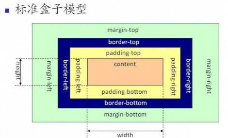
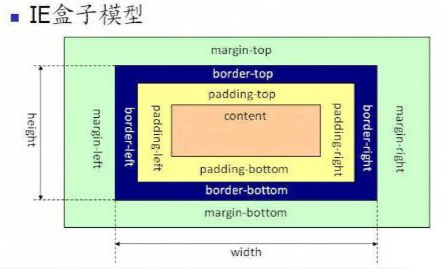

# HTML-04——盒模型

什么是盒模型？

盒模型就是描述元素在页面中占据的空间，每一个元素其实都可以看成是一个矩形盒子，这个盒子由四部分组成：`content`、`padding`、`border`、`margin`

盒模型又分为两种：标准盒模型和怪异盒模型（也就是我们常说的`border-box`和`content-box`）

`content-box`：当设置`height`、`width`的时候，指的就是`content`的高度\宽度

`border-box`：当设置`height`、`width`的时候，指的是`content` + `padding` + `border`的高度\宽度

那么我们该用哪个呢？毫无疑问：`border-box`，理由如下：

1. 更加直观，因为padding我们是理解成内边距，内肯定就是包含自身的高度
2. 更加方便：当我们设置元素的宽高、内边距，代码更加简洁易懂

