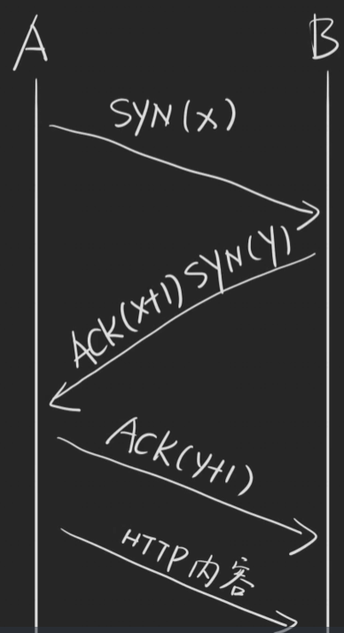
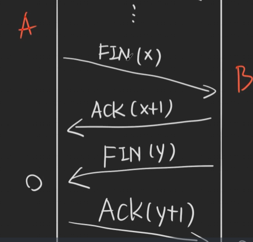

# Web性能优化-01——DNS与TCP

由于本人非科班，考虑到目前前端其实有很多非科班的，所以就把自己的见解提出来，如果感兴趣可以去专门学一下《计算机网络》《图解HTTP》等书籍来提高自己

## DNS 与 hosts

### DNS

DNS（`Domain Name System`），它将域名（比如：www.baidu.com）解析成`IP`地址（192.0.xx.x），以便于计算机能够相互通信

大致如下：

1. 你访问了`www.baidu.com`
2. 浏览器得知道对应的IP
3. 然后会问网络运营商（电信、联通、移动）,然后会告诉你IP地址（比如1.2.3.4）
4. 然后和这个`IP`建立`TCP`连接

细致来说：

1. 你访问了`www.baidu.com`
2. 浏览器先看看自己有没有这个的缓存，有缓存=>直接访问，没有=>
3. 问问操作系统(hosts：其实就是自定预先定义的IP地址)，操作系统有=>直接用，没有=>
4. 问网络运营商
5. 然后和这个`IP`建立`TCP`连接

# 三次握手

比如现在 A 和 B 打电话

1. A：拨号（第一次握手）
2. B：喂喂喂？（第二次握手）
3. A：喂喂喂！（第三次握手）（？？？这句话是不是多余呢？）
4. 开始说话

TCP连接**建立过程**之**三次握手**

1. A先发送一个SYN(x)——目的：知道A可以向B发送信息
2. B返回一个ACK(X+1) 也就是知道了，那么这个x+1是干什么的呢？也就是可能同时会有多个连接，我得告诉A我现在知道的是哪个连接,同时再返回一个自己的SYN(y)——目的：知道B能收到A的信息，并且B能发送信息
3. A返回一个ACK(y+1)——目的：知道A能够接受信息，这就是为什么要接受第三次的原因，就跟打电话一样，对方得知道现在在听你讲话，要不然就挂断了
4. 开始发送内容

## 四次挥手

同样，先用打电话来比喻：

1. A：我说完了
2. B：ok！
3. B：等等！爱你！（有时候没有这句话）
4. B：我也说完了
5. A：ok！

TCP**关闭连接**之**四次挥手**

1. A：FIN(x)，告诉B我已经完事了
2. B：ACK(x+1)，也就是B知道A说完了
3. B：FIN(y)，B对A说，我也说完了（为什么不能和2合并呢？因为可能B还要说点什么）
4. A：ACK(y+1)，A对B说好的