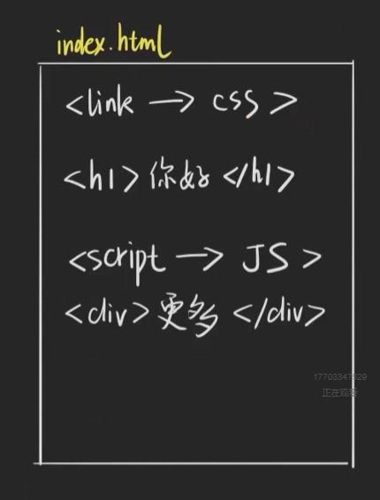

# 基本知识-02——浏览器

## `HTML`解析被`JS`阻塞

Eg：

`HTML`解析过程：下载HTML->解析HTML(边下载边解析，看浏览器)->下载CSS->解析CSS(边下载边解析，看浏览器)->下载JS->执行JS

这里，script标签出现在h1和div之间，所以浏览器会去下载JS，解析JS，然后再去下载HTML，解析HTML，所以的下载和执行会阻塞HTML的解析

那么为什么下载JS，执行JS会阻塞HTML解析呢？因为执行JS有可能会修改到HTML，导致改变DOM树

## `async` 和 `defer`区别

1. `defer`：发现有defer，会去继续下载JS，但是不会阻塞HTML解析，然后等待HTML解析完成后，执行JS，然后才会出现DOM ready

   保证了，JS的执行在HTML解析之后，DOM ready 之前

2. `async`：发现有`async`继续下载JS，但是不会阻塞HTML解析，，然后执行JS是在JS下载完毕之后，但是DOM ready 实在 HTML解析完成之后就出现了

## JS的执行被CSS阻塞

如果下载CSS时间过长，会影响到执行JS的过程，同理，解析CSS也是一样，为什么？

因为JS需要读取CSS的结果，因为JS里面可能会获取到元素的样式等信息

