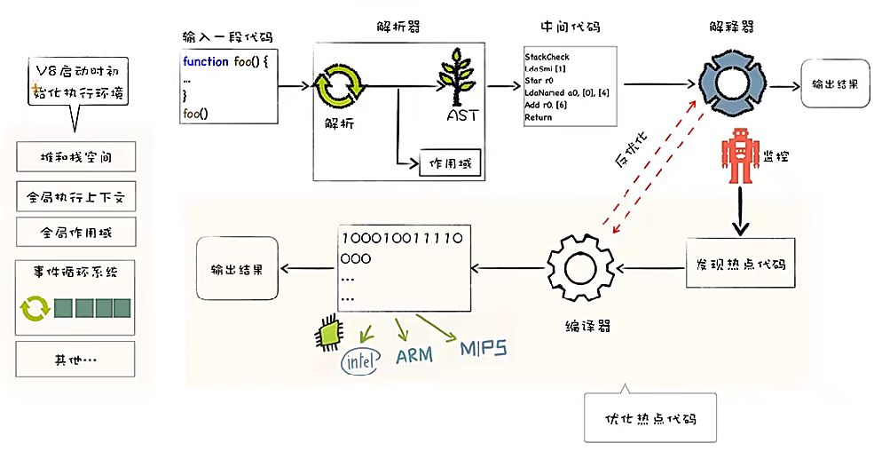

# `V8` 引擎

## `V8` 执行



**热点代码**：多次反复执行代码

反优化：当热点代码被修改了，此时二进制文件所存储的内容就不对了，就需要重新推给解释器，让解释器来重新执行。所以我们就要尽量避免反优化

> [!IMPORTANT]
>
> **减少反优化方法**：
>
> 1. 尽量保持对象的稳定性
> 2. 多次调用某个函数时（也会被标记为热点代码），尽量保持**参数类型**一致

## JavaScript 对象模型

### 什么是对象？

**类**：对相同事物、相似事物的综合

- [x] 对象具有唯一标识性（地址）
- [x] 对象具有状态（属性）
- [x] 对象具有行为（方法）

```javascript
const obj = {
    count: 1,
    func:function(){
        console.log('hello')
    }
}
console.log(obj.count)
// 实际上是取了 count 的 value，count还会有一些其他属性，比如 writable 是否可写，getter，setter ... 
Object.defineProperty(obj,"count",{
    get: function(){
        return 3
    },
    set: function(v){}
})
console.log(obj.count)
```

## `V8` 如何实现对象继承

### 基于类的设计

先有类，然后从类去实例化一个对象，类与类之间又可能会形成继承、组合灯关系

### 基于原型的设计

有两种实现思路：

- 一个是并不真的去复制一个原型对象，使得新对象持有一个原型的引用（`js`使用的方式）
- 第二种方法是实际地复制一个对象，两个对象并无关联

```js
({}).__proto__
```

当我们读取一个对象时候，如果该对象没有，则会去原型上找

```js
function Person(){}

const p = new Person()
// 1. 创建一个对象
// 2. 把该对象的 __proto__ 指向 Person.prototype
// p.__proto__ = Person.prototype
console.log(p.__proto__ === Person.prototype)
```

还可以这样子定义

```js
const a = {}
const b = {
    name:'hello'
}
a.__proto__ = b
console.log(a.name)
```

来个简单的例子

```js
const methods = [
    "push",
    "pop"
]

const newArr = Object.create(Array.prototype)

methods.forEach((method)=>{
    newArr[method] = function(){
        console.log('自己拦截了')
        // 同时还得执行原有的方法
        Array.prototype[method].apply(this,argument)
    }
})

const arr = [1,2,3,4]
arr.__proto__ = newArr
arr.push(5)

console.log(arr)
```

## `V8`拆箱机制

试想一下，当我们执行`1 + '1'`，结果是什么？`'11'`，在这个过程中是如何执行的？

```js
1 + '1'
Number(1).toString() + '1'
// Number(1).toString() 称之为 装箱转化
(1).toString() // '1'
// 这里也做了装箱转化
1.toString() // 报错
// 为什么会报错？因为把 1.toString()当成了数字的字面量,也就是看成了类似 1.1 这种小数的情况，所以产生了报错，所以得对其进行装箱转化，得把 1 看成一个对象，去找到对应的 toString 方法
```

当参与运算的是个对象的时候，是如何处理的呢？`V8` 会提供一个 **`ToPrimitive`**  的方法，作用是把两者转化为原始数据类型进行运算，步骤如下：

1. 先检测该对象种是否存在 `valueOf` 方法，如果有并返回了原始类型，那么就用该值进行强制类型转换
2. 如果 `valueOf` 没有返回原始类型，那么就使用 `toString` 方法的返回值
3. 如果两个方法都不返回基本类型值，则报错(`TypeError`)

这个规则可以解释很多 `js`有趣（~~奇葩~~）的情况

```js
[] + [] // ''
// [].valueOf() 存在，但是不是基本类型，于是调用 [].toString()，于是变成了 '' + '' = ''
[] + {} // '[object Object]'
// {}.valueOf() 存在，但是不是基本类型，于是调用 {}.toString() = '[object Object]'，于是变成了 '' + '[object Object]'  = '[object Object]'
{} + [] // 0
// {} 有两种含义，一个是对象字面量，一个是代码块，当 {} 在前会当作代码块，就会变成 + '' = 0，这里就会装箱转化 Number('') = 0
({}) + [] // '[object Object]'
```

这里就是 `V8` 的 **拆箱转化**

有了这些基础认识，那就会解决一些更加奇怪的题目

```js
// 如何让 a == 3 && a == 8 && a == 5 成立(注意==和===)
const a = {
    reg: /\d/g,
    valueOf: function(){
        // 正则 lastIndex
        return this.reg.exec('385')[0]
    }
} // 就可以进行拆箱转化：valueOf -> toString

// ([][[]] + [])[+!![]] + ([] + {})[!+[]+!![]] 输出什么？
([][[]] + []) = [][[]] + [] 
// 数组下标为 [] 的值 + 数组 = [][0] + [] = undefined + '' = 'undefined'
[+!![]] => !![] // 变成数字的字面量 !![] boolean
!![] => true => 1
([][[]] + []) => 'undefined'[1] => 'n'
([] + {}) => '[object Object]'
[!+[]+!![]] => [true + true] => [2]
 '[object Object]'[2] => 'b'
// 所以结果是 nb
```

## `V8` 如何实现闭包

闭包指的是一个函数，并且这个函数绑定了**词法环境**

```js
var x = 1 =>(编译) var x = undefined + x = 5 =>(执行)
```

### 惰性加载

V8 并不会一次把所有代码解析为中间代码，因为会严重影响首次执行`js`代码的速度，同时由于这些解析的代码都会存在内存中，一次性解析全部的代码会一直占用内存。

### 惰性解析

我们会把函数转换成一个函数对象(`Function Object`)，然后会记录 `name` 和 `code`，此时并不会执行 `AST`，只有当我们调用的时候，才会执行 `AST` 并且转换成 中间代码

```js
function test(a,b){
    var e = 100
    var f = 200
    return a + b + e + f
}
```

### 闭包特性

- 可以在 `js` 函数内部重新定义新的函数

```js
function a(){
    function b(){}
}
```

- 内部函数可以访问父函数中定义的变量

```js
function a(){
    const n = 1
    function add(){
        return n + 1
    }
    add()
}
```

- 函数是一等公民，所以函数可以作为另外一个函数的返回值

```js
function a(){
    const n = 1
    return function add(){
        return n + 1
    }
}
```

此时闭包的出现会导致惰性解析很麻烦

```js
function a(){
    const n = 1
    return function add(){
        return n + 1
    }
}
const test = a()
test()
// add 函数在执行完成后，a 函数是否应该被销毁？没有销毁，如何处理？
// 准备执行 => 调用 a 函数 => 调用 add 函数 => a函数执行结束 => add 函数执行结束
// 调用栈会出现 全局执行上下文 以及 a执行上下文
```

#### 执行上下文

跟踪记录代码运行时环境的抽象概念，每一次代码运行至少会生成一个执行上下文

执行上下文分为两种类型

1. 全局执行上下文
2. 函数执行上下文

有了执行上下文，就得有对应的管理工具——调用栈，管理在主线程执行的函数的调用关系，是一个**先进后出(LIFO)**的栈

#### 词法环境

基于代码词法嵌套结构用来记录标识符和具体变量或函数的关联词法，主要由三部分组成

- 环境记录：存放变量(存储 var 声明的变量)、函数声明
- 外层引用：提供了访问父词法环境的引用，全局环境的外层引用为null
- this绑定：确定当前环境中this的指向

#### 预解析器

对函数进行快速扫描，判断当前函数是否存在一些语法上的错误，检查函数内部是否引用了外部变量。如果检查出外部变量，会把栈中的变量复制到内存中，下次用到的时候直接使用内存中的值即可

## 异步

### 同步函数

当一个函数是同步执行时，那么当该函数被调用时不会立即返回，指导该函数把要做的事情全部做完才返回。

### 异步函数

当一个异步函数被调用时，该函数会立即返回，尽管该函数的操作任务并没有完成。那么该异步函数所规定的工作如何被完成？被另外一个线程完成。

### 进程 & 线程

进程：一个程序运行的实例

线程：操作系统能够运算调度的最小单元

## `EventLoop`

`js` 是一个单线程且非阻塞的语言

### `js` 为什么要设计成单线程？

如果两个线程同时对一个`dom`进行操作，如何处理？所以设计成单线程，但是由于单线程执行效率存在问题，所以出现 `web worker`，`web worker` 受到主线程的限制，不能独立执行，主要用于一些开销大的计算功能

### 事件队列

这个是为什么 `js` 是单线程但不会阻塞的原因

### 宏任务 & 微任务

宏任务：宿主发起的任务；微任务：`js` 引擎发起的任务

宏任务：`setInterval`，`setTimeout`

微任务：`Promise().then(function(){})，只有.then里面的回调才属于微任务,Promise本身属于同步任务`，`new MutationObserver()`

异步队列也分为两种：宏任务队列和微任务队列，先会查看微任务队列，再会查看宏任务队列

```js
setTimeout(()=>{
    console.log(1)
})
// 放入宏任务队列
new Promise((resolve,reject)=>{
    console.log(2)
    resolve(3)
}).then((val)=>{
    console.log(val)
    // val = 3 放入微任务队列 
})
// 输出 2 3 1
```

```js
setTimeout(()=>{
    console.log(1)
})
// 放入宏任务队列
new Promise((resolve,reject)=>{
    console.log(2)
    resolve(3)
}).then((val)=>{
    console.log(val)
    setTimeout(()=>{
        // 会把它放到下一次事件循环
        console.log(4)
    })
})

// 2 3 1 4 
```

那么为什么要设计微任务呢？解决了宏任务执行时机不可控的问题，如果没有微任务，那么我们每次去宏任务队列里面取，那么什么时候执行是不可控的，不知道执行多久。如果我有一个紧急的任务，那么我们无法进行操作。所以才有了微任务的出现，能够将紧急的任务放到微任务队列中

## 异步编程解决方案

主要是为了解决**回调地狱**，用同步的方式来书写异步代码

- 发布/订阅
- deferred对象
- Promise
- Generator
- `async/await`

### 发布订阅

```js
let eventMap = {}

function pub(msg, ...rest){
	eventMap[msg] && eventMap[msg].forEach((cb)=>{
        cb(...rest)
    })
}

function sub(msg,cb){
    eventMap[msg] = eventMap[msg] || []
     eventMap[msg].push(cb)
}
```

观察者模式 和 发布订阅模式 有什么区别？

发布订阅模式是完全解耦的，发布者不需要关注订阅者；观察者模式里面就是被观察者，它只需要维护一套观察者Observer的集合，将有关状态的任何变更自动通知给他们的watcher，这个设计是松耦合的

### Generator

```js
function* gen(x){
    let y = yield x + 2 
    return y
} 
// yield 暂停 区分多个阶段

const g = gen(1) // 返回的是内部的指针，并不会执行函数体内的代码
g.next() // next 方法会调用 {value:3,done:false} done 表示是否执行完成
g.next() // {value:undefined,done:true}，需要自己手动传参上次结果
```

#### 数据交换

```js
function* gen(x){
    let y = yield x + 2 
    return y
} 
const g = gen(1)
g.next() // {value:3,done:false}
g.next(2) // {value:2,done:true}，
```

#### 错误处理

```js
function* gen(x){
    try{
        let y = yield x + 2 
    }catch(e){
        console.log(e)
    }
    return y
}

const g = gen(1)
g.next()
g.throw("出现错误")
```

#### 问题

目前不知道何时执行每个阶段，何时交出执行权

#### 基于`Thunk`函数的`Generator`自动执行器

传值调用：先计算值，然后在进行调用

传名调用：直接调用，用到的时候再计算

```js
const x = 6

function f(n){
    return n * 2
}
f(x + 5) // 传值调用 先会计算 x + 5，再调用f
// 等同于
const thunk = function(){
    return x + 5
}
function f(thunk){
    return thunk() * 2
}
```

实现一个自动执行Generator函数

```js
function run(gen){
    const g = gen()
    function next(data){
        const result = g.next(data)
        if(result.done){
            return result.value
        }
        result.value.then((data)=>{
            return data.json()
        }).then((data)=>{
           next(data)
        })
    }
    next()
}

run(gen)
```

#### CO 模块

是专门为 `Generator` 做的自动执行器，了解即可

#### `async/await`

`async`就是`Generator`函数的语法糖，`async`函数返回的是一个Promise对象，基本都使用过不过多赘述基本用法

线程睡眠：类似其它语言中的 `sleep` 方法

```js
function sleep(interval,i){
    console.log(i)
    return new Promise((resolve)=>{
        setTimeout(resolve,interval)
	})
}

async function test(){
    for(let i = 0;i < 5;i++){
        await sleep(1000,i)
    }
}
```

## web worker

为了创建多线程环境，在主线程运行的同时，worker在后台运行，互不干扰，在worker完成后，把结果返回给主线程；这样主线程不会被阻塞或拖慢

```js
const worker = new Worker()
```

如何实施？我们可以把阻塞时间长的`js`任务迁移到worker线程中，减少主线程负担，需要注意，执行时间是不会变，目的是为了减少主线程的负担（`UI`、流畅度等）

通过`postMessage`来推送消息，通过`onmessage`来收到消息

```js
const worker = new Worker('./worker.js')
worker.postMessage('主线程推送了一条消息')
worker.onmessage = (e) =>{
    console.log(e.data)
}

// worker.js
self.onmessage = (e) =>{
    console.log(e.data)
    postMessage('worker推送了一条消息')
}

self.close()
```

由于worker是创建了一个线程，所以说得注意运行环境，比如worker没有 `Document`、`Window`，也就是没有`DOM API`

